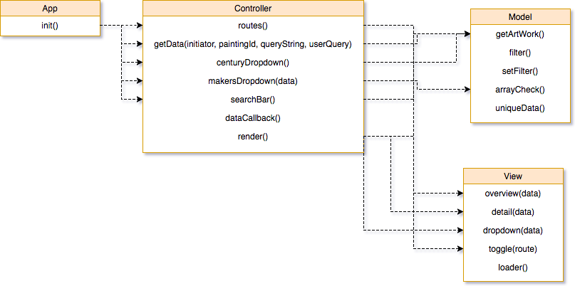

# Rijksmuseum
The Rijksmuseum application is an Single Page Web App that I created from scratch. The application makes no use of frameworks and is completely build in vanilla javascript. The application makes it possible to search through the art collection of th Rijksmuseum. 

## Features
- Search by name 
- Filter art by name
- Filter art century

## Getting started

Clone the repo and install the dependencies with
```
$ npm install
```
Create your own config.js file with these variables:
```
var key = {
    value: "your key"
};

```
To start the app run
`$ npm run start`

### Wishlist
-  [ ] Adding more filter options
-  [ ] Store art in the database


## Flow diagram


## SPA Diagram


### Sources
- http://projects.jga.me/routie/
- http://rijksmuseum.github.io/
- http://krampstudio.com/aja.js/
- http://handlebarsjs.com/
